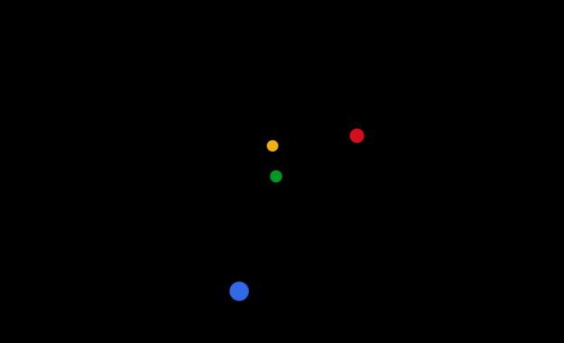
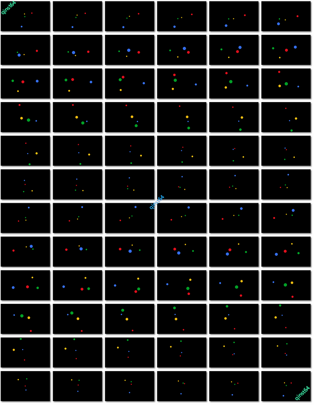
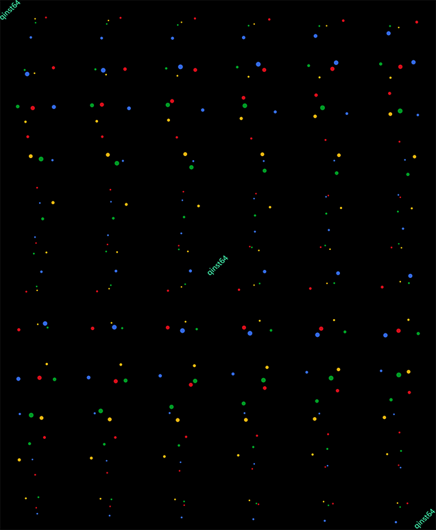
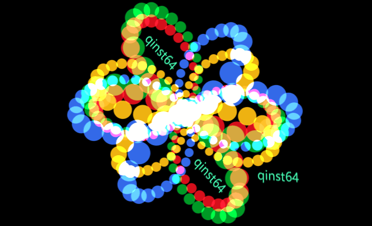
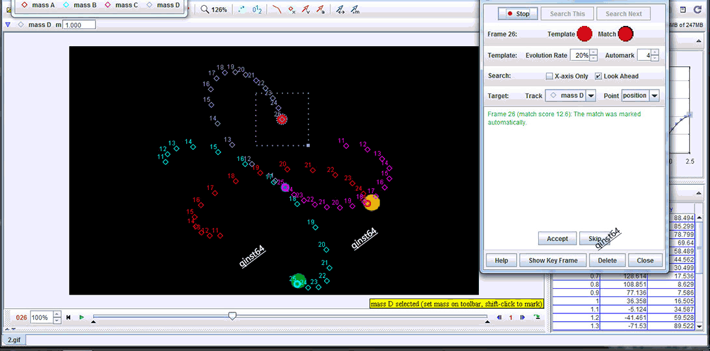
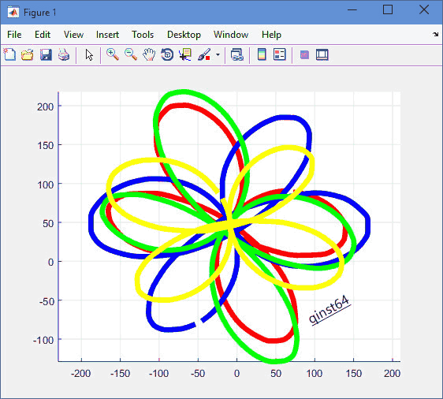
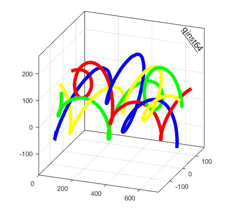

### bootanimation-trajectory
Analysis of the android 5.0 lollipop bootanimation particle trajectories

---

#### Introduction
A boring stuff I did years ago. The magic bootanimation attracts me: my eyes always lose themselves when trying to catch the magic trajectories of the particles. How can this happen? What is the secret behind?

#### Bootanimation
The `bootanimation.zip` contains a series of `png` images and a `desc.txt` . The images can be extracted from the zip file, which is located in `/system/media/`.

To display the animation, I combined the images into a gif...

#### Image concatenation
List out all the images...

without margin...

or even overlap (concatenation from z)...

#### Frame by frame analysis

Still, above tricks do not show what I want (last one is close). Some analytical tool is needed to quantify the movement...

Then use matlab to plot the trajectories (with interpolation) ...

Visualization of the trajectories with an additional axis: time...

Code is [here](trajectory.m) (contains particle location data extracted from each frame)

### Conclusion
The above pictures show the results. Em... the trajectories do not seem to be symmetric... 
